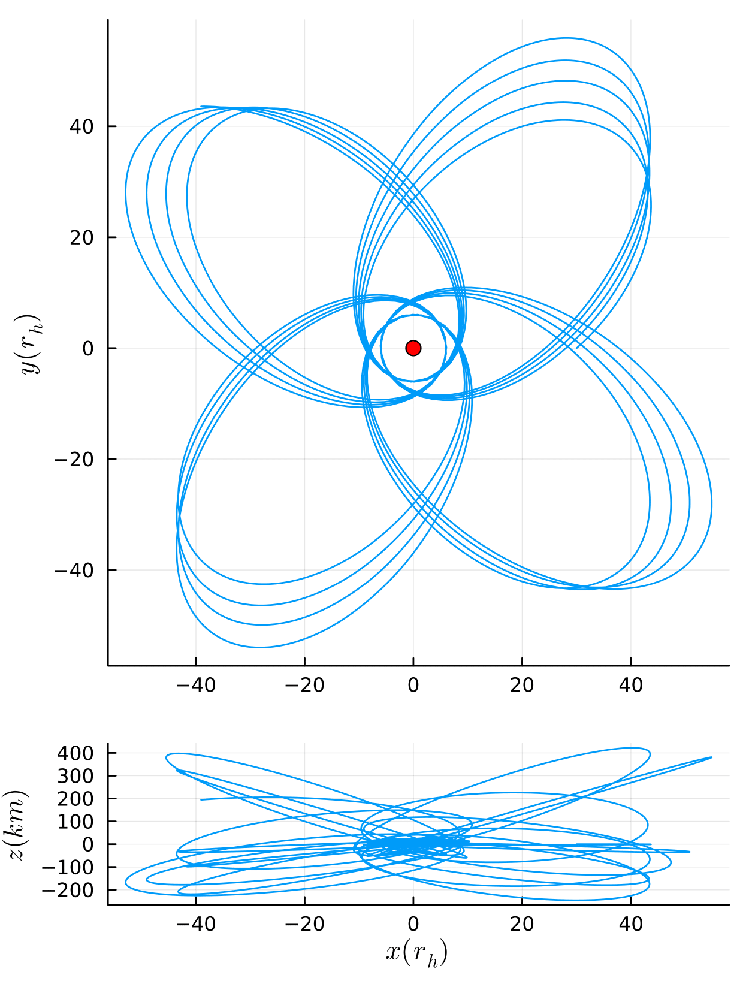

# RelativisticDynamics.jl

Welcome to RelativisticDynamics.jl!

The focus of this package is to numerically solve orbital equations for the Kerr spacetime.

Please see the [documentation](https://tomkimpson.github.io/RelativisticDynamics.jl/dev/).

